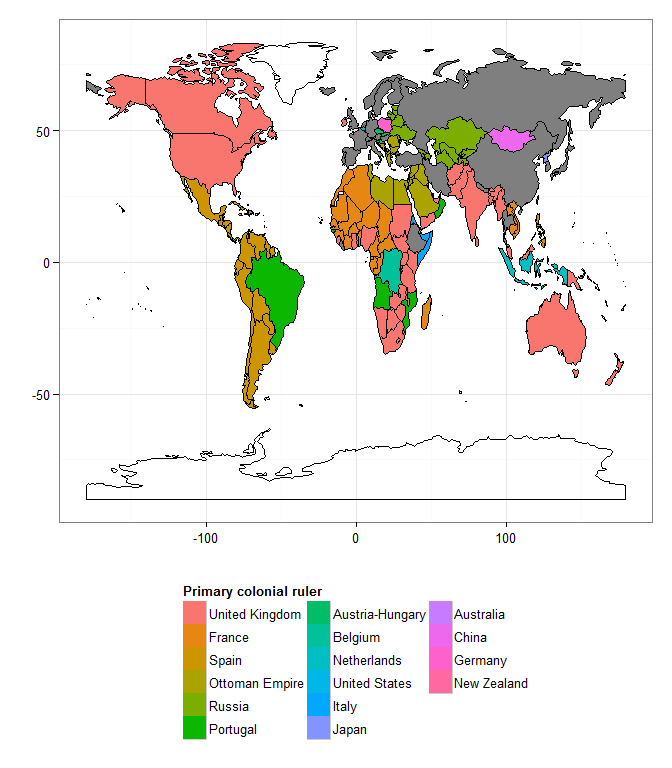
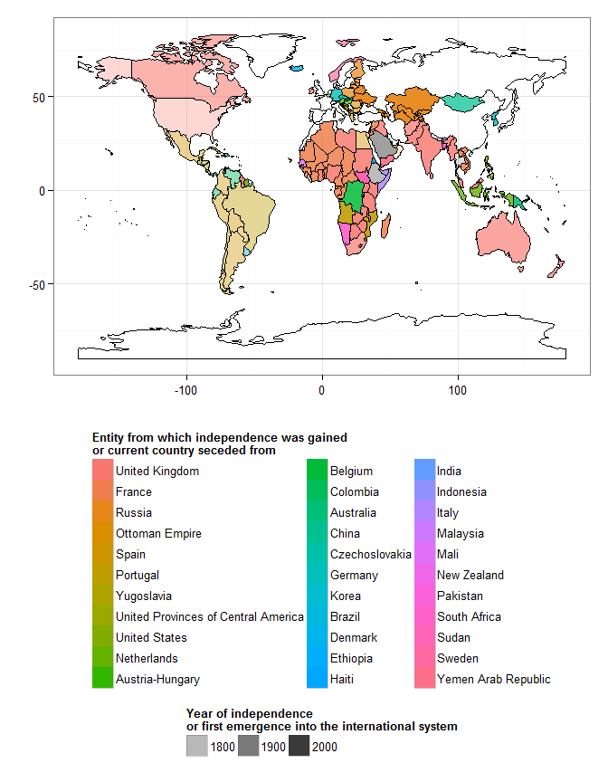
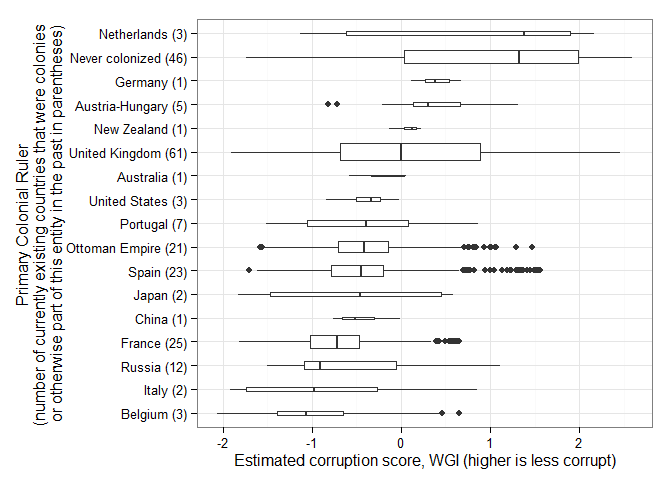
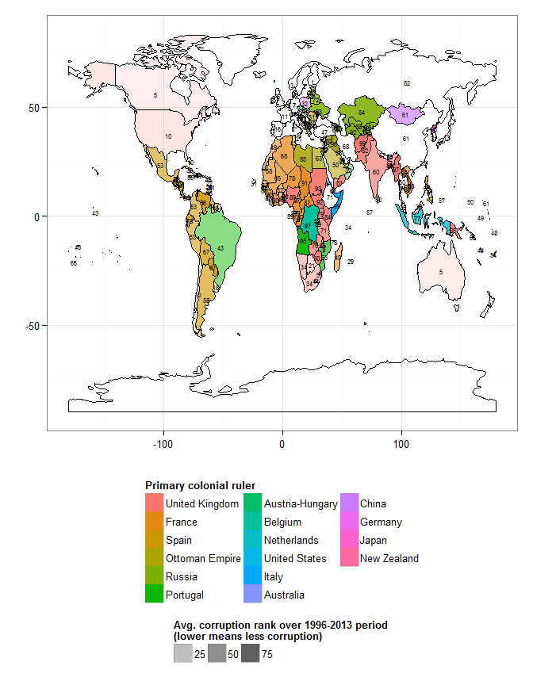
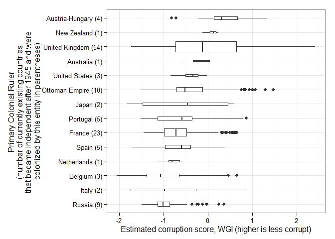
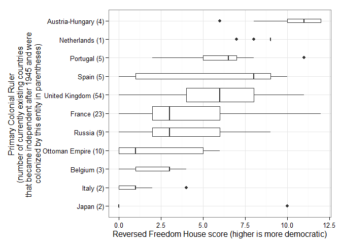

# RCE: Visualizing the Results, Part IV: The Colonial Origins of Corruption?

(Following a suggestion from Grace Carroll, this post looks at potential correlations between colonial origins and corruption. For the rest of the posts in the series, see [here](http://politicalpathologies.blogspot.co.nz/search/label/rce). This post is more optional than the rest, since it does not make use of your own data).

(Last updated 2015-06-03 16:27:57)

Grace wanted to know whether there is any correlation between colonial history and political corruption today. This is a difficult question to answer properly, but here's a first stab at showing you some patterns.

Political history is complicated. Many currently existing countries were colonized by multiple powers at different points in time, and colonization has displayed many variants, from highly indirect forms of rule to direct annexation. Nevertheless, [Paul Hensel][ICOW] has collected data on the "primary colonial ruler" of each country currently in the international system (thanks Grace for pointing this dataset out to me). This is "[t]he colonial or imperial power that was most responsible for shaping the development of the entity (or entities) that became this modern state. This is typically the state that ruled over the majority of [a current country] (for cases where multiple colonial powers held parts of what became the modern state) or the state that ruled over [a current country] for the longest time (for cases where the colony changed hands one or more times before independence)" (Hensel, Colonial History Dataset Codebook, p. 6). 

The first graph I want to show you is just a map displaying the "primary colonial ruler" of each country in the world:

 

Among countries that exist today, the largest number were at some point British colonies; the second largest number were never colonies of any existing country (or at least were not fully incorporated into an empire; some countries suffered at the hands of colonial powers, like China, without ever having been fully colonized), and the third largest were colonies of France. The world today has thus been deeply shaped, for good or ill, by the legacy of European empires. Most of the currently existing countries in the world were at some point European colonies (often British), though independence dates vary widely, and the countries from which currenly existing countries gained their independence were not necessarily their primary colonial rulers. In the graph below countries are colored according to the country from which they gained their independence, rather than their "primary colonial ruler," with more transparent countries having earlier independence dates:

 

Nevertheless, assuming that the primary colonizer had the greatest influence over a country's long-term institutions, we can then look at the distribution of corruption scores by primary colonial ruler:[^Box]

 

We need to interpret this graph with care, given the vast differences in colonial experiences across the world. But basically what it says is that the three countries that were at some point part of, or colonies of, what is now the Netherlands (Belgium, Luxembourg, and Indonesia) have the highest median corruption scores (i.e., less corruption); countries that were never colonized (most of Western Europe, China, Thailand, etc.) have the second highest median corruption scores today (second-lowest levels of corruption, on average), though with a very wide spread (some countries that were never colonized have very high levels of corruption, others have very low levels), and so on. Belgium (which colonized the Democratic Republic of the Congo, Rwanda, and Burundi) has the worst record here.

Here's how that data looks in map form (more transparent countries are less corrupt; the number on top of each territory is the average corruption rank over the 1996-2013 period, according to the [WGI][WGI]):

 

If we restrict ourselves only to those countries that achieved independence in the post WWII era (and excepting modern-day Germany and Taiwan, which are kind of complicated cases), this is what we find:

 

Countries that achieved their independence after 1945 and whose primary colonial ruler was Britain (even if they achieved their independece from somebody else) have lower levels of corruption, on average, than countries whose primary colonial ruler was France or Spain; and Russia and Italy have the worst record.

Finally, here's a graph showing the distribution of Freedom House scores of democracy, by primary colonial ruler:

 

On average, countries that were colonized by Spain and achieved their independence since 1945 have had higher levels of democracy (with a big spread) than countries colonized by Britain or France, though French colonies have done worse, on average, than British colonies by this measure.

I'm not sure what this all adds up to. The legacy of colonialism seems to have had an impact, but colonial experiences have varied greatly over the last two centuries, even within a single European empire. Corruption outcomes within former British colonies, for example, have varied enormously, even if they differ, on average, from outcomes within former French colonies. 

What do you think of this? What questions do you have?

All code for this post is available [in this repository][Code]. If you are technically minded and want to learn some more, you might wish to download the [R programming language](http://www.r-project.org/) and [RStudio](http://www.rstudio.com/) and play with it; I can help you if you are interested. (If you want to replicate the graphs and correlations above, you will also need [Paul Hensel's Colonial History Dataset, available here][ICOW].)

[^Box]: The width of each box is proportional to the number of currently existing countries each power colonized; the Netherlands only colonized 3 currently existing countries, the United Kingdom 61.

[Rydland]: http://www.nsd.uib.no/rapport/nsd_rapport124.pdf
[WGI]: http://info.worldbank.org/governance/wgi/index.aspx#doc-methodology
[TI]: http://www.transparency.org/
[Code]: https://github.com/xmarquez/RCE-2015
[Polity]: http://www.systemicpeace.org/inscr/
[FH]: http://freedomhouse.org
[ICOW]: http://www.paulhensel.org/icowcol.html
