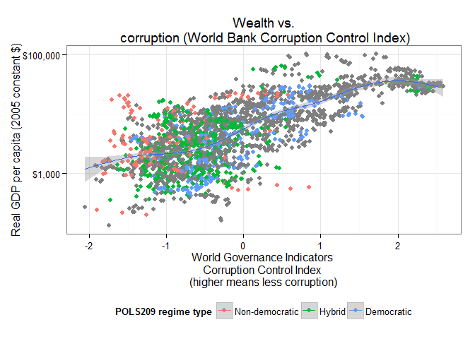
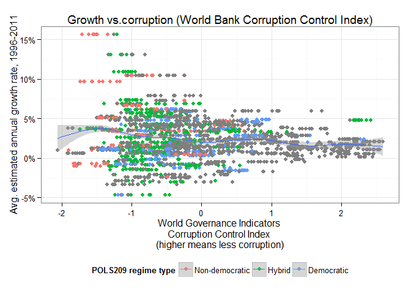

# RCE: Visualizing the Results, Part III: Wealth and Corruption

(This post explores some correlations between corruption and wealth. For the rest of the posts in the series, see [here](http://politicalpathologies.blogspot.co.nz/search/label/rce). It will also be updated if any final late submissions come in -- I think there may be a couple of people who are still working on their classification. I've corrected some small errors in the previous version of the dataset, so you should take a look at the previous posts as well).

(Last updated 2015-06-03 09:03:25)

In the [last post of this series](http://politicalpathologies.blogspot.com/2015/05/rce-visualizing-results-part-ii.html), we saw that though there was a slight correlation accross countries between "being more democratic" and "being less corrupt," there was little obvious correlation between corruption and democracy *over time*: countries that became more democratic over the two decade period we investigated did not seem to have become obviously less corrupt, or vice-versa. We do not necessarily have a good explanation for this, but I suggested that wealth might have something to do with it. In this post, I look at correlations (across countries and over time) between corruption and wealth (as measured by GDP per capita).

The first graph shows a simple scatterplot between the *level* of income at a given point in time, per person (in constant 2005 American dollars -- that is, inflation-adjusted numbers) and the [WGI][WGI] index of corruption perceptions. Each dot represent a country-year (e.g, Singapore 2006); if a particular year was classified by POLS209, it is given a color representing the regime type the class gave it.[^Levels]

 

As you can see, there is a fairly strong correlation between high income per capita and low corruption; almost all very rich countries (whatever their regime type) display low levels of corruption (or, more precisely, corruption perceptions), while poorer countries tend to be seen as more corrupt. A few middle-income countries are fairly corrupt but no highly corrupt country is among the very rich (income greater than about $25,000 per capita). The richest highly corrupt country is Equatorial Guinea, a result of the sudden influx of oil money there in the 1990s. (Almost all of this money was captured by the political elite, however; most people in Equatorial Guinea are very poor).

This correlation, of course, does not tell us much about causation; we do not know if countries become rich because they happen to be less corrupt, or if they are seen as less corrupt because they are rich, or something else. A proper study of the relationship between these things would need a sophisticated statistical model in order to even begin to talk about causality, and we do not have the time or technical know-how to do that here. But we can at least take a look at the temporal relationship between corruption and income per capita in each country. The graph below is ordered from poorest to richest country, and it plots the corruption rank (grey ribbon) and the percentile rank of income (dots, colored by POLS209 regime type) on the same scale, per year:

 

As we can see, with some exceptions, the income rank of a country tracks quite well its corruption rank. The exceptions are nevertheless interesting. The 30 countries with the greatest differences between income rank and corruption rank are indicated in this graph, ordered from greastest difference to smallest difference:  

 

Equatorial Guinea, Russia, and Turkmenistan are perceived as *more* corrupt than their income levels would indicate (the corruption ribbon is below their income rank), while Eritrea, Madagascar, Burkina Faso, El Salvador, Lesotho, and Rwanda are less corrupt than their income ranking would indicate (the corruption ribbon is above their income rank - remember "less corrupt" is higher in this graph). Why might this be the case? Does it have something to do with the political systems of these countries? 

Here's one potential story. It seems plausible that in some countries where the political elite is kept in power by means of corruption -- personal systems of rule, as in Equatorial Guinea -- you might have more corruption than the income of the country would indicate. This relationship might be exacerbated in oil-dependent economies (like Equatorial Guinea or Venezuela). By contrast, in a place like Eritrea or Zimbabwe, what you might be seeing is the decay of a revolutionary party - at first, after victory in revolution and war, the elite is highly austere and uncorrupt, but later things decay under the pressures of the struggle for power. But all of this would require more specific research into these countries; I do not know if these stories correspond to reality.(It's for you to figure out whether there's any evidence of this in specific cases!)

The last graph I want to show you concerns economic *growth* and corruption. (Remember economic growth is a measure of how quickly total income in a country is increasing; but it is not a measure of how wealthy a country is on a per person basis. China is growing faster than the USA, but it is a much poorer country on a per person basis, even though their economies are of similar size). Here I plot the average estimated annual rate of per capita income growth against the corruption control index:  

 

The plot has a characteristic funnel shape: countries with low corruption (right side of the graph) always have moderate growth rates; countries with high corruption (left side) can have both very high and very low growth rates. (Both growth "disasters," like Guinea or Fiji in this period, and growth "miracles," like Equatorial Guinea, Myanmar, or China, cluster at the high corruption end of the graph, in other words). Why might that be the case?

What questions do you have? What else might you like to see, if anything?

All code for this post is available [in this repository][Code]. If you are technically minded and want to learn some more, you might wish to download the [R programming language](http://www.r-project.org/) and [RStudio](http://www.rstudio.com/) and play with it; I can help you if you are interested. (If you want to replicate the graphs and correlations above, you will also need a spreadsheet with the Freedom House scores, available [here](https://drive.google.com/file/d/0B5wyt4eDq98GZVhUamRKVXJpLVU/view?usp=sharing), the [WGI Corruption Control Index][WGI], available in the repository, and the [expanded trade and GDP dataset by Kristian Gleditsch][Gleditsch].)

[^Levels]: Note that the *level* of per-capita income at a given point in time is not the same thing as the rate of *growth* of income at a given point in time; poor countries (e.g., China even today -- though China is now more of a middle-income country) can be growing quickly, and rich countries can be growing slowly or not at all (e.g., Spain today). And of course the total income of a country, divided by its population (which is more or less what GDP per capita means) doesn't say anything about how that income is distributed -- in some cases, much of that income may be captured by a small elite. But we work with the numbers we have, not the numbers we would like to have. 

[Rydland]: http://www.nsd.uib.no/rapport/nsd_rapport124.pdf
[WGI]: http://info.worldbank.org/governance/wgi/index.aspx#doc-methodology
[TI]: http://www.transparency.org/
[Code]: https://github.com/xmarquez/RCE-2015
[Polity]: http://www.systemicpeace.org/inscr/
[FH]: http://freedomhouse.org
[Gleditsch]: http://privatewww.essex.ac.uk/~ksg/exptradegdp.html
